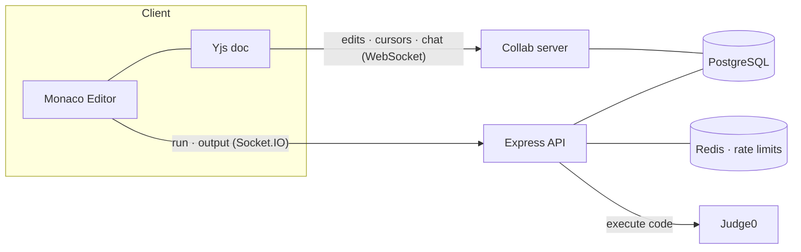

# CodeMesh

A real-time collaborative code editor — share a room, write code together with live cursors, chat, and run it in the browser. Built around **CRDT-based collaborative editing (Yjs)**, so concurrent edits merge instead of overwriting each other.

<!--
Demo GIF: record two browser windows editing the same room (cursors + chat),
save it as docs/demo.gif, then uncomment the line below.

-->

> **Demo:** open two browsers on the same `/room/:id`, type in both, and watch cursors, edits, and chat sync live. _(Drop a recording in `docs/demo.gif` and uncomment the image tag above.)_

---

## Features

- **Real-time collaborative editing** — multiple people edit the same file at once; edits merge via CRDT (no last-write-wins clobbering).
- **Live cursors & presence** — see who's in the room and where their caret is, colored per user.
- **In-room chat** — persisted in the shared document, so it survives a page refresh.
- **Run code** — JavaScript, TypeScript, Python, Java, C, and C++, executed in a sandbox (Judge0) with stdin and output.
- **Auth** — email/password (bcrypt + JWT cookie) and Google OAuth.
- **Rate limiting** — Redis-backed limits on code execution and auth endpoints.

## Tech stack

**Client:** React 19, Vite, TypeScript, Tailwind CSS, Monaco Editor, Yjs (`y-monaco`, `y-websocket`), Socket.IO client.

**Server:** Node (ESM) + Express 5, a custom Yjs WebSocket sync server (`yjs` + `y-protocols`), Socket.IO, PostgreSQL, Redis, Passport (Google OAuth), JWT, and Judge0 for code execution.

## Architecture



The interesting part is the collaboration layer:

- The document, language, remote cursors, presence, **and chat** all live in a single **Yjs document** per room, synced over a WebSocket. Because Yjs is a CRDT, two people editing the same line converge to the same result — there's no "last writer wins."
- `y-websocket` v3 ships no server and `@y/websocket-server` pulls a conflicting prerelease Yjs, so the server implements the y-websocket **sync protocol directly** against the same `yjs` / `y-protocols` versions the client uses (`server/src/collab.ts`).
- The room document is loaded from Postgres **once, server-side, before any client syncs**, so late joiners don't each seed a duplicate copy. It's persisted on a debounce and again when the last client leaves, with a short grace period so a refresh doesn't tear down in-memory state.
- The WebSocket upgrade runs the same JWT-cookie check as the REST endpoints, so the document isn't an unauthenticated back door into a room.
- Socket.IO is kept only for run-output fan-out; everything collaborative rides Yjs.

## Getting started

### Prerequisites

- Node 20+
- Docker (for PostgreSQL, Redis, and Judge0)

### 1. Services

PostgreSQL (included compose file):

```bash
docker compose up -d
```

Redis (rate limiting):

```bash
docker run -d --name redis-server -p 6379:6379 redis:7
```

Judge0 (code execution) — follow the [Judge0 install guide](https://github.com/judge0/judge0); it should be reachable at `http://127.0.0.1:2358`.

Create the database tables:

```sql
CREATE TABLE users (
  id       SERIAL PRIMARY KEY,
  username TEXT NOT NULL,
  email    TEXT UNIQUE NOT NULL,
  password TEXT NOT NULL
);

CREATE TABLE rooms (
  room_id    TEXT PRIMARY KEY,
  code       TEXT,
  language   TEXT,
  updated_at TIMESTAMPTZ DEFAULT CURRENT_TIMESTAMP
);
```

### 2. Server

```bash
cd server
npm install
cp .env.example .env   # fill in JWT_SECRET and SESSION_SECRET (openssl rand -hex 32)
npm run dev
```

The server refuses to start without `JWT_SECRET` and `SESSION_SECRET`; Google OAuth is optional (sign-in is disabled if the credentials are unset).

### 3. Client

```bash
cd client
npm install
npm run dev
```

Open the printed URL (default `http://localhost:5173`), sign up, create a room, and share the `/room/:id` link.

## Project structure

```
client/   React + Vite front end (editor, rooms, auth)
server/   Express API + Yjs collaboration WebSocket
  src/collab.ts    custom y-websocket sync server + persistence
  src/index.ts     REST API, auth, code execution, Socket.IO
docker-compose.yml PostgreSQL
```

## Notes & known limitations

- Room documents are held **in memory on a single instance**. Running multiple server instances would need sticky sessions or a shared backplane (e.g. a Redis-backed Yjs provider).
- Chat and the document survive refreshes and reconnects; the document is also persisted to Postgres, while chat is currently kept only for the live session.
- Joining a room requires an account. "Share a link, no login" (guest join) is a planned enhancement.
